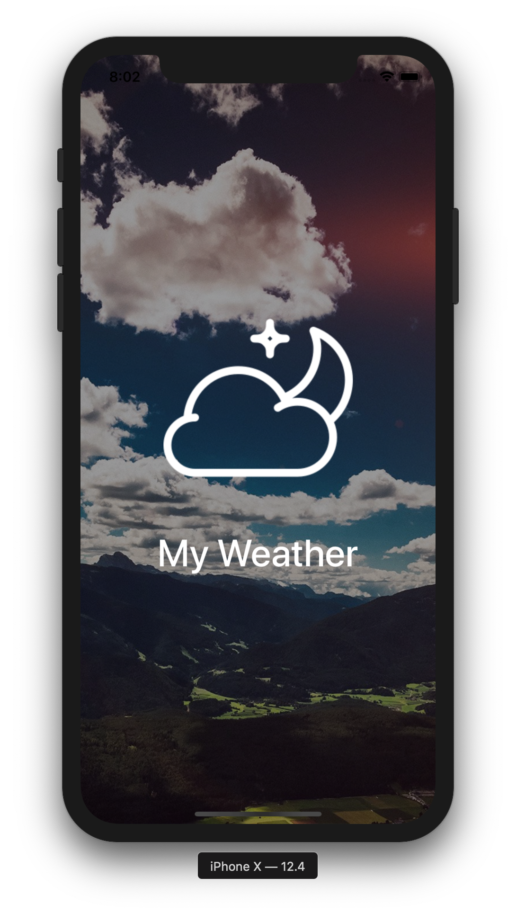
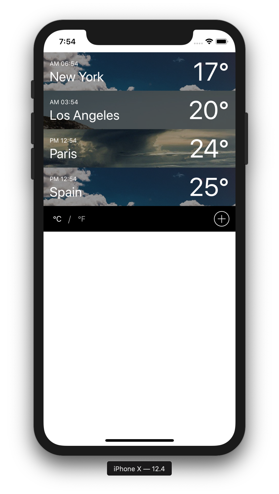
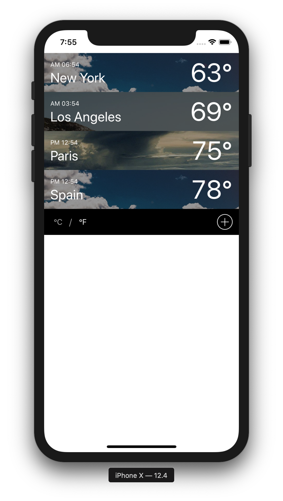
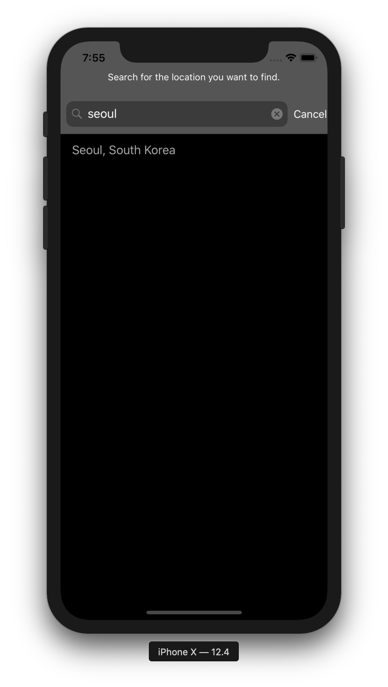
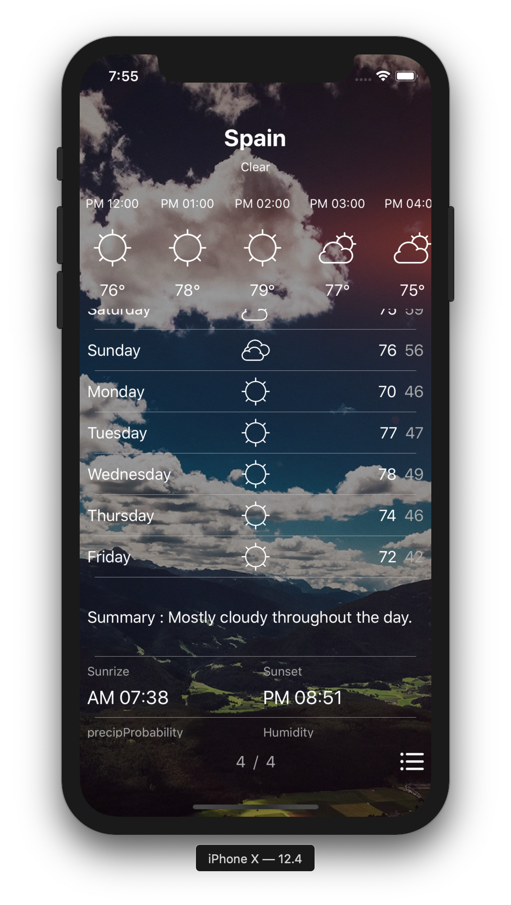
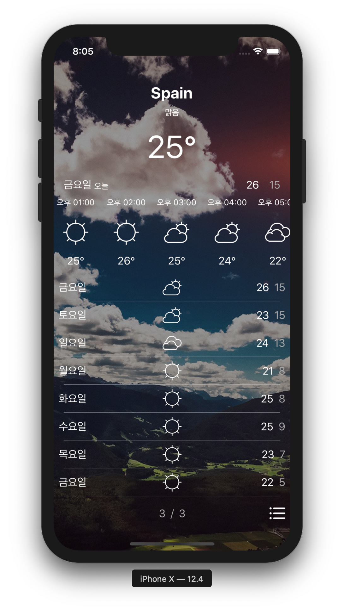

# MyWeather
#### Imitation of Apple's weather

	

## 프로젝트 설명

- 애플 날씨 앱의 기능과 UI를 모방한 프로젝트
	- Library 사용 : X
	- Localizing : 한국어, 영어
- Main
	- UserDefault 를 사용하여 앱을 종료하더라도 검색한 지역들은 그대로 유지
	- Dispatch Group 을 사용하여 지역들에 대한 요청이 모두 완료 되었을 때 한꺼번에 UI를 업데이트 할 수 있도록 만듦
- AddRegion
	- Timer 를 이용하여 유저가 텍스트를 0.5초 이상 치지 않은 경우에만 네트워크 요청을 할 수 있도록 함
	- Delegate 를 이용하여 Main 에 지역을 추가하는 이벤트를 전달 하였음
- RegionDetail
	- Scroll View 내부에 CollectionView와 TableView를 사용하여 데이터를 표현
		- CollectionView 에는 시간별로 데이터를 표현
		- TableView에는 디테일한 정보들을 표현
		- ScrollView delegate를 통해서 2개의 스크롤을 통제하여 날씨앱의 스크롤과 동일하게 구현

## 실행 스크린샷

## GIF

